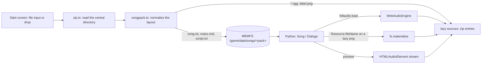

# Song packs from a zip file

The start screen can take one `.zip` of songs, a "song pack", before the game starts.
Its songs show up as a library in the song chooser. Packs are often 1–3 GB, so the zip
is never loaded as a whole. The game reads the zip index once, copies the small files it
needs into MEMFS, and reads audio from the zip on demand.

## Decisions

| Topic | Decision |
|---|---|
| File access | A plain `<input type="file" accept=".zip">`, plus drag and drop onto the start screen. The file is only available for the current page session. |
| Scope | Charts are read from named MIDI tracks (`PART GUITAR`). `drums.ogg` plays as an extra background stem. |
| Previews | The song chooser preview streams `song.ogg` alone through a media element and does not decode stems. |
| Where | The start screen only. |
| How many | One pack at a time. |
| Very long songs | Songs whose decoded stems exceed a memory budget cannot be played; the game shows a message instead. No streaming playback. |

## Survey of the example packs

All of the packs are standard zips: none are encrypted, none need ZIP64, and every
entry is stored or deflated. The `.rar` copy of the GH I–III pack is not supported, but
a `.zip` of the same pack exists.

| Pack | Size | Songs | Layout | Guitar track | Notes |
|---|---|---|---|---|---|
| Band Hero | 1.0 GB | 65 | `<song>/` | `PART GUITAR` #3 | 4 stems, `album.png`, `titles.ini` |
| Guitar Hero 5 | 2.0 GB | 85 | `<song>/` | `PART GUITAR` #3 | non-ASCII names (`Mötley Crüe`), a latin-1 `song.ini`, a 13.7 min song |
| GH I–II–Encore–III | 1.8 GB | 189 | `<pack>/<game>/<song>/` | `T1 GEMS`/`PART GUITAR` #1, 2× format 0 | FoF-native, `label.png`, one song without `song.ogg`, stray `notes2.mid`/`song.ini~` |
| GH Smash Hits | 1.0 GB | 48 | `<song>/` | `PART GUITAR` #2–3 | `thumbs.db`, a `Rhythm.ogg`, MIDI division 100 |
| GH World Tour | 3.1 GB | 84 | `<song>/` | `PART GUITAR` #3 | offsets above 2³¹, one song without `song.ogg` |
| Rock Band 2 | 1.4 GB | 84 | `<song>/` | `PART GUITAR` #1 | `Song.ini`, `Notes.mid`, `Guitar.ogg` (capitalized) |
| Rock Band | 0.8 GB | 67 | `<song>/` | `PART GUITAR` #1 | capitalized names, `PART GUITAR COOP` |

Findings that drive the design:

- **Charts.** In four of the seven packs, FoF 1.3 would read the drums chart, because
  it only accepts notes from tracks 0–1. `MidiInfoReader` does not filter tracks at
  all, so it also reports difficulties from the drums and bass charts.
- **Case.** MEMFS is case-sensitive, and the Rock Band packs capitalize every file name.
- **Names.** Zip entry names without the UTF-8 flag are Windows-1252 in practice, not
  the CP437 that the zip spec implies.
- **Offsets.** GH World Tour has local header offsets above 2³¹, so every 32-bit field
  must be read unsigned.
- **Nesting.** GH I–III nests songs two levels deep under a wrapper folder.
  `getAvailableLibraries` only finds folders that contain songs directly or have a
  `library.ini`.
- **Audio memory.** Stems are 44.1 kHz stereo Vorbis. Decoded at 48 kHz as float32 PCM,
  a typical 4-minute song with 4 stems needs about 360 MB. The long songs:

  | Song | Length | Decoded size |
  |---|---|---|
  | Free Bird | 9.8 min | 0.9 GB |
  | Frampton, *Do You Feel Like We Do* | 13.7 min | 1.26 GB |

- **Files FoF 1.3 ignores.** `drums.ogg` is present in five packs; FoF 1.3 has no drums
  stem. It also ignores `titles.ini` (tiers and unlocks) and `album.png`. It never reads
  `song.ini` keys such as `diff_*`, `hopo`, `icon`, `unlock_*`, `lyrics` and `tags`.
  `delay` is supported.

## Architecture

### 1. Start screen (`src/game.ts`)

- The start gate gets an "Add song pack (.zip)" button, which is a hidden file input.
  Dropping a zip on the gate works the same way.
- After a pick, the gate shows the pack name, the song count and any warnings (skipped
  entries, unsupported methods), with a "Remove" link.
- **Indexing runs when the pick happens, not in the click that starts the game.** Parsing
  the directory is asynchronous, and the Play click has to create the `AudioContext`
  synchronously.
- `localStorage` remembers the last pack's file name. After a reload, including a game
  restart, the gate says "Select *Band Hero.zip* again to use your song pack". This is
  the cost of the plain file input.
- A file that is not a zip, or a zip without any `song.ini`, gets a clear error and the
  game still starts.

### 2. Zip reader (`src/zip.ts`)

This is a small, dependency-free reader over a `Blob`. It only uses `blob.slice()`, so it
never reads the whole file.

1. **End record.** Read the last `min(size, 65 557)` bytes and scan backwards for the
   end-of-central-directory record (`PK\5\6`). If a ZIP64 locator (`PK\6\7`) is present,
   read the ZIP64 end record. `0xFFFF` and `0xFFFFFFFF` sentinels resolve through the
   ZIP64 extra field (id `0x0001`).
2. **Central directory.** Read it in one slice (about 100 KB for 1 000 entries). Each
   entry keeps `name`, `method`, `flags`, `compressedSize`, `size` and `localOffset`.
   All 32-bit reads go through `DataView.getUint32` (offsets above 2³¹), and 64-bit
   values are converted to `Number` after checking `Number.isSafeInteger`.
3. **Names.** With flag bit 11 set, decode as UTF-8. Otherwise try strict UTF-8 first,
   then fall back to `TextDecoder('windows-1252')`.
4. **Reading an entry.**
   - Read the 30-byte local header to get its own name and extra field lengths, which
     can differ from the central directory.
   - Slice the data. Method 0 returns the slice as is. Method 8 pipes it through
     `DecompressionStream('deflate-raw')`.
   - Encrypted entries (flag bit 0) and other methods are rejected.
   - The output must not grow past the declared `size`; that is the zip-bomb guard.
     Files copied into memory at startup are also capped (for example 16 MB each).
5. **API.** `openZip(blob) → { entries }`, `readEntry(entry) → Promise<Uint8Array>`, and
   `entryBlob(entry) → Promise<Blob>`. The last one is for media elements: stored entries
   return a zero-copy slice, deflated entries use `new Response(stream).blob()`.

### 3. Pack layout (`src/songpack.ts`)

These rules turn zip entries into a MEMFS tree under `/game/data/songs/<pack>/`, where
`<pack>` is the zip file name without `.zip`.

- **Path hygiene.**
  - Convert `\` to `/`.
  - Drop empty segments and `.` segments.
  - Reject absolute paths and any entry with `..` or NUL.
  - Directory entries (names ending in `/`) are ignored.
- **Wrapper folder.** If every entry shares one top-level folder and the root has no
  `song.ini`, strip that folder (GH I–III).
- **Song folders.** A folder is a song when it contains `song.ini`, in any case. Only
  these files are exposed, with their names lowercased and the folder names kept as
  they are:
  - `song.ini`, `notes.mid` and `script.txt`
  - `song.ogg`, `guitar.ogg`, `rhythm.ogg` and `drums.ogg`
  - `label.png`, or `album.png` renamed to `label.png` when there is no `label.png`

  Everything else is ignored, for example `thumbs.db`, `notes2.mid` and `song.ini~`.
- **Libraries.** Any folder on the way to a song folder that has no songs of its own gets
  an empty synthesized `library.ini`, so that `getAvailableLibraries` can walk down to it.
  This includes the pack root in GH I–III. `LibraryInfo` then names it after the folder.
- **Pack label.** A root `label.png` becomes the pack library's `label.png`. `titles.ini`
  is ignored.
- **What goes where.**
  - Copied into MEMFS right away: `song.ini`, `notes.mid` and `script.txt`. The chooser
    reads every `notes.mid` to list difficulties. That is about 9–16 MB per pack here,
    inflated at startup with no caching between sessions.
  - Lazy: `label.png` files and all audio are zero-length stubs whose lazy source is the
    zip entry.
- **Timing.** This runs in `startGameRuntime` after `installGameFiles` and before
  `fof_web.main.run`, so the first library scan sees the pack.

### 4. Lazy sources (`src/fs.ts`, `src/runtime.ts`, `src/audio.ts`, `fof_web/fs.py`)

- `files.lazy` becomes `Map<string, LazySource>`, where `LazySource` is either
  `{ url }` or `{ zip, entry }`. It has `bytes(): Promise<Uint8Array>` and
  `blob(): Promise<Blob>`.
- The bridge replaces `lazyUrl` and `fetchBytes` with `isLazy(path)`, `readLazy(path)`
  and `lazyBlobUrl(path)`. `lazyBlobUrl` returns either the URL or an object URL.
- `WebAudioEngine.load` calls `source.bytes()`, and `fs.materialize` uses `readLazy`.
- Page 03 and its test switch to the new names.
- `Resource.fileName`, on emscripten only: when the resolved path is lazy and not `.ogg`,
  call `fs.materialize(path)` before returning. This is the single hook that makes
  `label.png` load when the chooser shows a song. Audio is never materialized.

### 5. Game changes (Python, `src/`)

- **MIDI track selection (`Song.py`).**
  - Before reading, pre-scan the `MTrk` chunks for the first track-name meta event
    (`FF 03`). The guitar track is the first one named exactly `PART GUITAR` or
    `T1 GEMS`, ignoring case.
  - If a track is named, `MidiReader.note_on`/`note_off` only accept that track. If
    none is, keep the legacy rule (tracks 0 and 1), which covers format 0 files and
    older charts.
  - `MidiInfoReader` gets the same filter.
  - Tempo is still read from every track.
  - `MidiWriter`, used by the editor, is not changed.
- **Drums stem (`Song.py`).** When `drums.ogg` exists (and not in preview mode), load it
  as a `StreamingSound` on channel 3 at the rhythm volume. It plays, pauses, stops and
  fades with the rhythm track. The engine's shared start time keeps all stems aligned.
- **Missing `song.ogg`.** Already handled: `guitar.ogg` becomes the song and the guitar
  mute has no effect.
- **Leftover writable songs (`Song.py`).** Writable copies of pack songs persist in IDBFS
  under `~/.fretsonfire/songs/<pack>/…`. That covers `song.ini` with high scores, plus
  `notes.mid`. On emscripten, `getAvailableSongs` and `getAvailableLibraries` skip
  writable-only entries that have no read-only counterpart. Without this, a pack that
  is not loaded would still list songs that cannot load. High scores return when the
  same pack name is loaded again.
- **`song.ini`.** `Config` already reads latin-1 and ignores unknown keys.

### 6. Audio memory and loading (`src/audio.ts`, `fof_web/audio.py`)

- **Parallel stems.** `Song.__init__` calls `fofaudio.prefetch([paths])` (browser only)
  before creating `Music` and `StreamingSound`. Stems then inflate and decode in
  parallel, and the constructors find them in the cache.
- **Eviction.** Buffers under `/game/data/songs/` belong to a song folder. Loading a stem
  from a different song folder drops the cached buffers of every other song folder that
  is not playing. Sound effects outside `songs/` stay cached.
- **Long-song guard.** The compressed bytes are already in memory before
  `decodeAudioData`. Read the Vorbis identification header (channels) and the granule
  position of the last Ogg page to get the duration without decoding.
  - Estimate: `duration × ctx.sampleRate × channels × 4`, summed over the song's stems.
  - If the estimate exceeds `SONG_PCM_BUDGET` (1 GB), `load` rejects with a
    `SongTooLong` error. Python shows "This song is too long for the browser version".
  - In the example packs only the Frampton song, 1 of about 620, is over the limit.
  - Previews are exempt because they stream.

### 7. Previews (`Song.py`, `fof_web/audio.py`, `src/audio.ts`)

- On emscripten, `loadSong(playbackOnly=True)` passes only `song.ogg` (or `guitar.ogg`
  when `song.ogg` is missing) and creates `Audio.Music(path, stream=True)`.
- `fof_web.audio.Music` in stream mode calls `fofaudio.streamMusic(path)`. That creates
  an `HTMLAudioElement` from `lazyBlobUrl(path)` and routes it through a
  `MediaElementAudioSourceNode` into the music gain, so volume and fades still work.
- Position comes from `element.currentTime`, which is good enough for a preview.
- Stopping, or loading another preview, pauses the element and revokes the object URL.
- Credits (`defy`, `playbackOnly`) uses the same path with a normal URL.

## Testing

- **Fixture (`tests/fixtures/make-pack.ts`).** A minimal zip writer based on
  `node:zlib.deflateRawSync`. It builds a small pack at test time from the bundled songs,
  with:
  - a wrapper folder, sub-libraries, capitalized file names, and a Windows-1252 name
    without the UTF-8 flag;
  - both stored and deflated entries;
  - a Rock Band style MIDI with `PART DRUMS` at #1 and `PART GUITAR` at #3;
  - a `drums.ogg`, and a song without `song.ogg`;
  - an Ogg stub whose last page claims a 30-minute granule, for the long-song guard;
  - junk files, a `../evil` entry, and an encrypted-flag entry.
- **`tests/11-zip.spec.ts`** (reader unit tests in a page):
  - EOCD search, including a zip comment;
  - a synthesized ZIP64 record;
  - offsets above 2³¹ via fake headers over a sparse `Blob`;
  - name decoding;
  - the deflate size guard;
  - path rejection.
- **`tests/12-song-pack.spec.ts`** (game): `setInputFiles` on the start gate, then Play,
  then open the chooser, and check:
  - the pack library and its sub-libraries are listed;
  - the selected track is `PART GUITAR`: the note count in the state JSON matches the
    fixture;
  - the drums stem plays;
  - the preview uses a media element and fetches no stems;
  - the long-song guard shows its message;
  - after reload without the pack, the gate prompt appears and no leftover songs are
    listed.
- **Desktop.** `test_core.py` gains track-selection tests with synthesized MIDI bytes,
  and they run on desktop and in Pyodide.
- **Manual.** Load each of the example packs, check the startup indexing time and memory
  in DevTools, and play one song per pack.

## Implementation steps (one local commit each)

1. `zip.ts`, its test page and `11-zip.spec.ts`.
2. MIDI track selection in `Song.py` plus the `test_core.py` cases. This is useful on
   desktop too.
3. Lazy sources: generalize `files.lazy` and the bridge, and add the `Resource.fileName`
   materialize hook. Update page 03.
4. `songpack.ts` normalization and mounting, the start-gate UI, and the fixture with
   `12-song-pack.spec.ts` covering listing and playing.
5. The drums stem, parallel prefetch and eviction.
6. The long-song guard.
7. Streaming previews.
8. Hiding leftover writable songs, and the reload prompt.
9. Manual pass over the example packs, then update `implementation-plan.md` status.

## Known limitations

- The pack must be picked again after every reload or game restart, because a plain file
  input does not survive either.
- One pack at a time. Only guitar charts: bass, drums and vocals charts are not playable.
  Tiers, unlocks and lyrics are ignored.
- Songs whose stems decode to more than 1 GB cannot be played.
- Only `.zip` files with stored or deflated entries are supported. `.rar`, `.7z`,
  encrypted zips, and methods such as Deflate64, bzip2 and LZMA are not.
